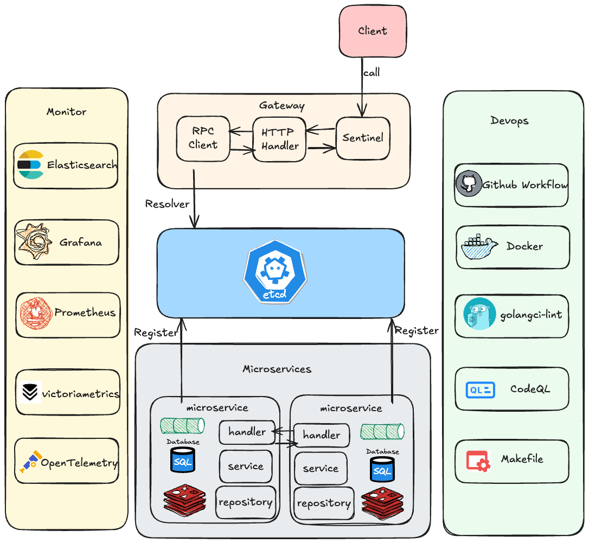
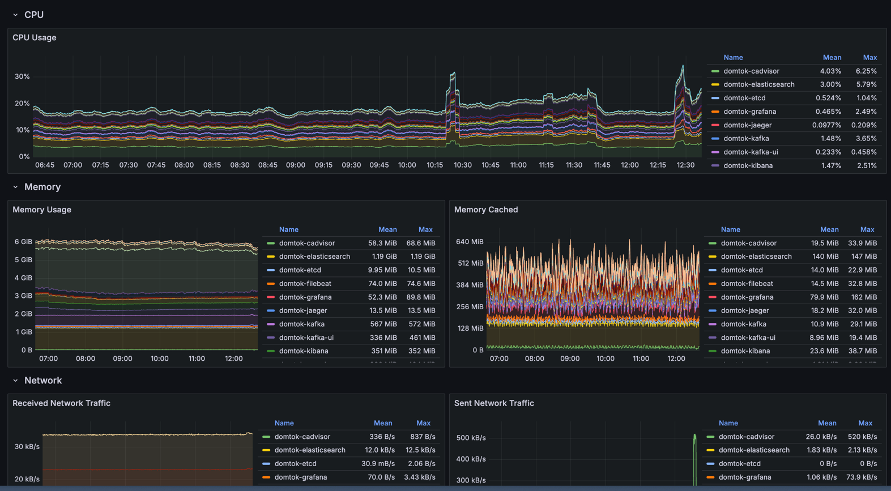
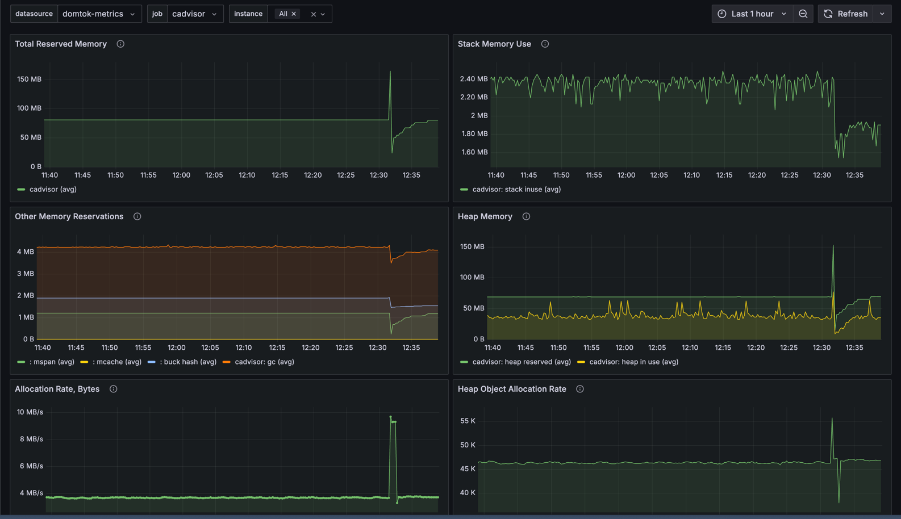
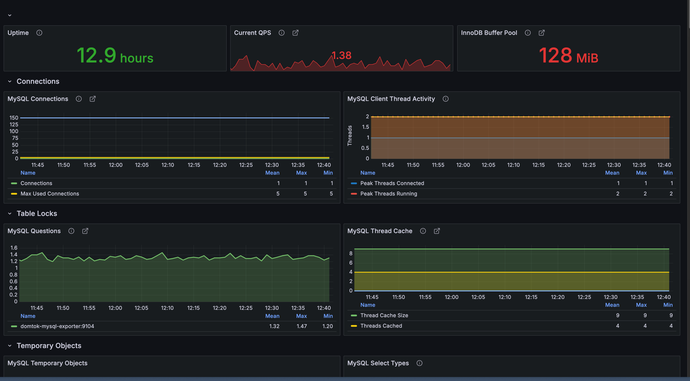
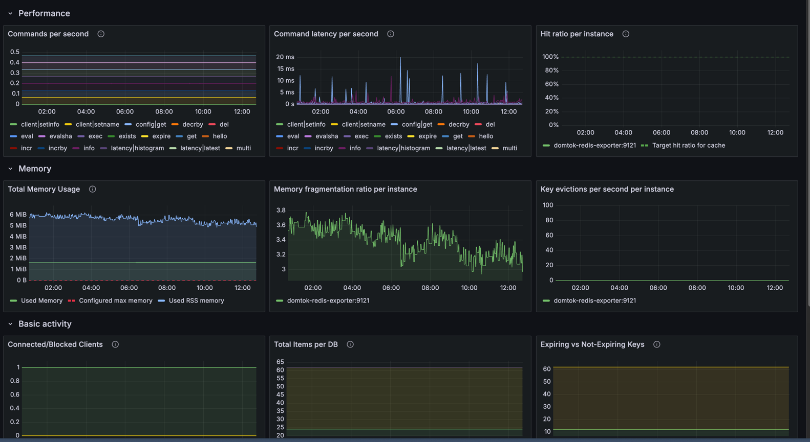
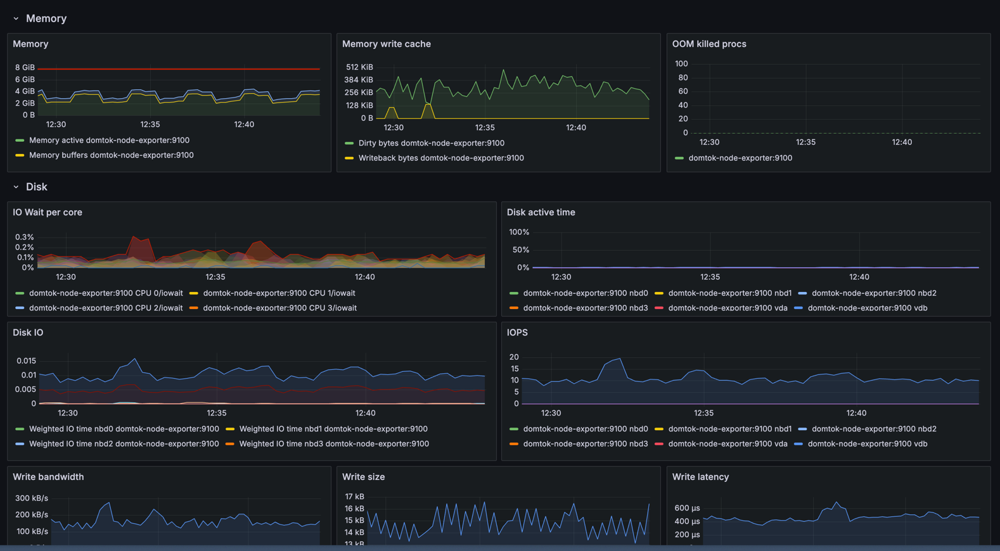
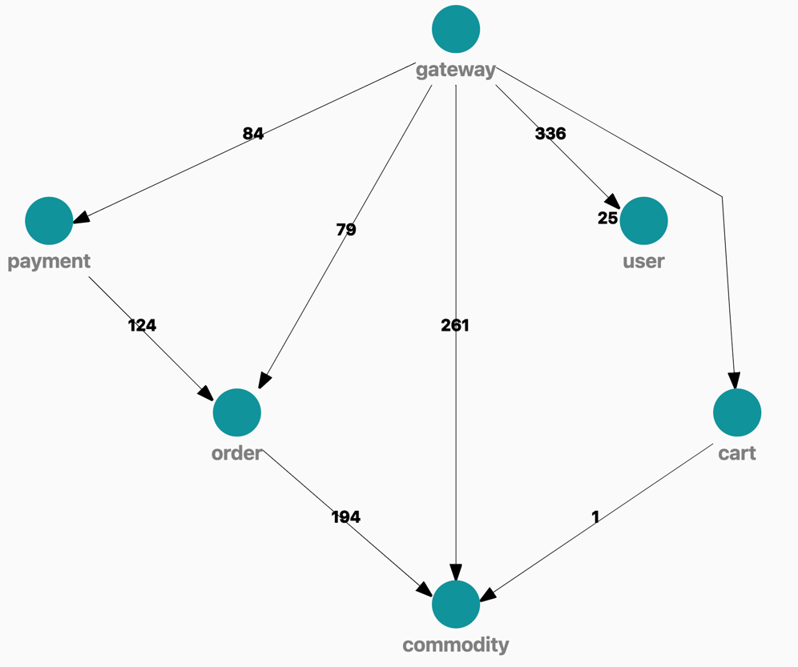

<div align="center">
  <h1 style="display: inline-block; vertical-align: middle;">DomTok</h1>
</div>

<div align="center">
  <a href="#overview">English</a> | <a href="docs/README.zh.md">简体中文</a>
</div>

## Overview
DomTok 是一个基于HTTP和RPC协议，使用整洁架构，基于分布式架构的简单抖音电商后端。他使用到了 Kitex，Hertz，Mysql，Redis，Etcd，Kafka，Elasticsearch，Kibana，Filebeat，
Jaeger，Rocketmq，Otel-Collector，several-exporter，Prometheus，VictoriaMetrics，Cadvisor 和 Grafana。

## Features
- 云原生：采用原生 Golang 分布式架构设计，基于字节跳动的最佳实践。
- 高性能：支持异步 RPC、非阻塞 I/O、消息队列和即时编译（JIT）。
- 可扩展性：模块化、基于整洁架构分层的结构设计，代码清晰易读，降低了开发难度。
- 可观测性：基于 OpenTelemetry 的分布式追踪、Prometheus 监控、Elasticsearch 日志收集、Grafana 可视化。
- 代码质量：基于 Github Actions 的 CI/CD 流程，丰富的单元测试，代码质量高，安全性高。
- AI 功能：基于字节跳动的 Eino 框架与 LLM 的 **Function Calling** 实现文本输入调用接口。
- DevOps：丰富的脚本和工具减少了不必要的手动操作，简化了使用和部署流程。

## Architecture



### Coding architecture


## Project structure

### Overall
```text
.
├── LICENSE
├── Makefile                # 一些 make 命令
├── README.md     
├── app                     # 各个微服务的实现
├── cmd                     # 各个微服务的启动入口
├── config                  # 配置文件
├── deploy                  # 部署文件
├── docker                  # docker 相关
├── go.mod
├── go.sum
├── hack                    # 用于自动化开发、构建和部署任务的工具
├── idl                     # 接口定义
├── kitex_gen               # Kitex 生成的代码
└── pkg
    ├── base                # 通用基础服务
    │   ├── client    	    # 对应组件(redis, mysql e.g.)的客户端
    │   └── context         # 自定义上下文，用于在服务间透传数据
    ├── constants           # 存储常量
    ├── errno               # 自定义错误
    ├── kafka               # 对 kafka 功能的一些封装
    ├── logger              # 日志系统
    ├── middleware          # 中间件
    ├── upyun               # 又拍云的一些封装
    └── utils               # 一些工具函数
```

### Gateway/Api module
```text
./app/gateway
├── handler                 # 处理请求的 handler
├── model                   # hz 生成的 model
├── mw                      # 中间件
├── pack                    # 封装请求和响应
├── router                  # 路由
└── rpc                     # 发送RPC请求
```

### Microservice (order module)
```text
./app/order
├── controllers       # rpcService 接口的实现层，负责转换请求与响应
├── domain            # 整洁架构中的领域层
│   ├── model         # 定义 module 内使用的结构体
│   ├── repository    # 定义 module 内使用的接口
│   └── service       # 实现可复用的核心业务逻辑
├── infrastructure    # 整洁架构中的 interface 层，为避免歧义命名为 infrastructure
│   ├── locker        # domain-repository 中 locker 接口的具体实现
│   ├── mq            # domain-repository 中 mq 接口的具体实现
│   ├── mysql         # domain-repository 中 db 接口的具体实现
│   ├── redis         # domain-repository 中 cache 接口的具体实现
│   └── rpc           # domain-repository 中 rpc 接口的具体实现
└── usecase
```

## Test
- 单元测试：本项目利用 `github/bytedance/mockey` 与 `github.com/smartystreets/goconvey/convey` 进行了丰富的单元测试，你可以使用 `make test` 来运行测试。  
- 带环境的单元测试：除了需要 mock 的单元测试之外，我们还利用了环境变量来控制了测试环境，让我们的部分单元测试可以在真实的环境中运行。你可以使用 `make with-env-test` 来启动环境并运行这些测试。  
- API 接口测试：我们使用了 **Apifox** 来进行接口的全自动测试，保证了接口。你可以在 [这里]() 查看我们的测试用例。

## Visualization Example
接下来将展示我们通过 `Prometheus`、`Grafana`、`VictoriaMetrics`、`Jaeger`、`Filebeat`、`Otel-Collector` 等工具实现的可视化效果。（由于数据过多故仅展示部分）

### Docker 


### Go Programs（total） 


### Mysql


### Redis


### System


### Jaeger



## Quick start and deploy
这个项目已经通过脚本大大的简化了流程，你可以参考[部署文档](docs/deploy.md)来快速启动和部署项目。

## Contributors

<a href="https://github.com/west2-online/DomTok/graphs/contributors">
  
</a>
