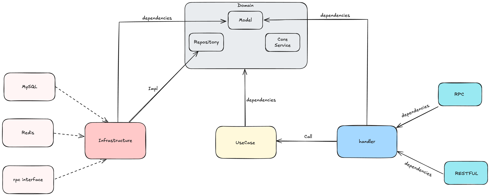
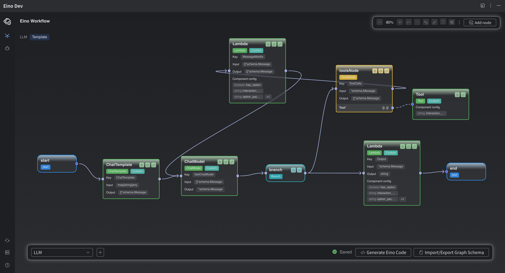
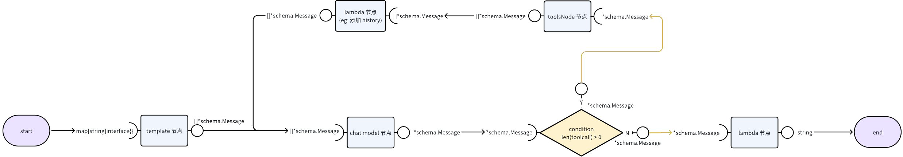
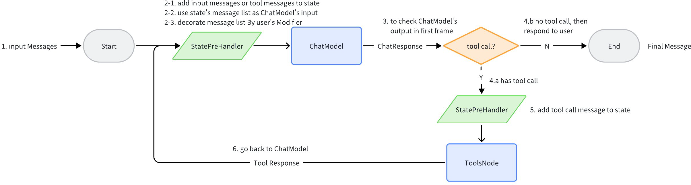
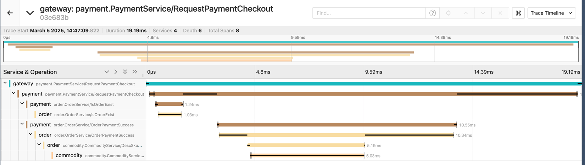
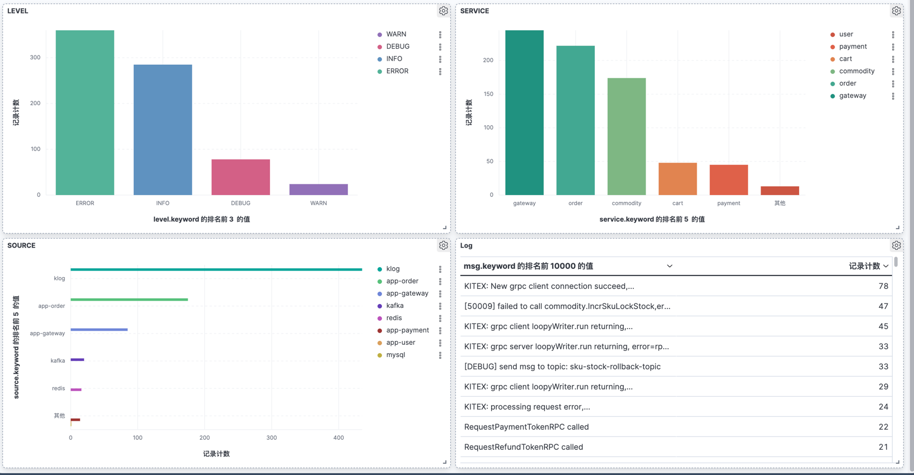
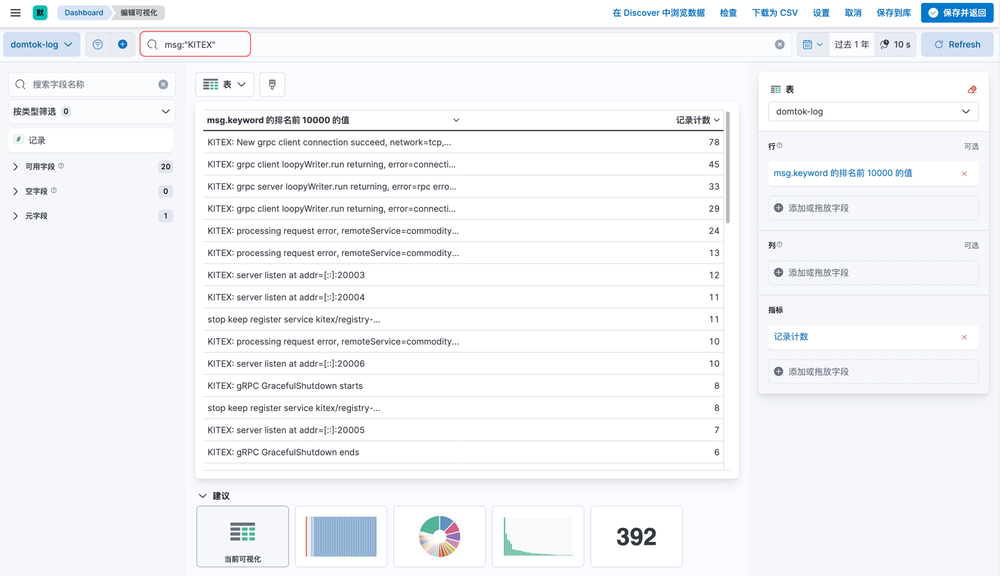
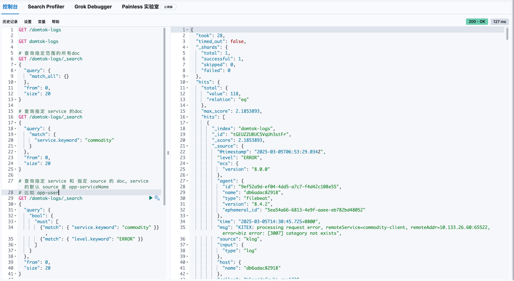

<div align="center">
  <h1 style="display: inline-block; vertical-align: middle;">DomTok</h1>
</div>

<div align="center">
  <a href="#overview">English</a> | <a href="docs/README.zh.md">简体中文</a>
</div>

## Overview
DomTok is a simple backend project for Douyin e-commerce based on HTTP and RPC protocols, adopting the clean architecture and distributed architecture. It utilizes technologies such as Kitex, Hertz, Eino, Mysql, Redis, Etcd, Kafka, Elasticsearch, Kibana, Filebeat, Jaeger, Rocketmq, Otel-Collector, several exporters, Prometheus, VictoriaMetrics, Cadvisor, and Grafana.

## Features
- Cloud-native: Designed with a native Golang distributed architecture, based on the best practices of ByteDance.
- High-performance: Supports asynchronous RPC, non-blocking I/O, message queues, and Just-In-Time (JIT) compilation.
- Scalability: With a modular and layered structure design based on the clean architecture, the code is clear and readable, reducing the development difficulty.
- Observability: Implements distributed tracing based on OpenTelemetry, uses Prometheus for monitoring, leverages Elasticsearch for log collection, and provides visualization through Grafana.
- Code quality: Implements the CI/CD process based on GitHub Actions, has rich unit tests, and ensures high-quality and secure code.
- AI functionality: Based on ByteDance's Eino framework and Large Language Model (LLM), it enables text input to call interfaces through **Function Calling**.
- DevOps: Abundant scripts and tools reduce unnecessary manual operations and simplify the usage and deployment processes.

## Architecture


### Coding Architecture
We have carried out a layered design for the project based on the clean architecture, as shown in the following figure:


## Project Structure

### Overall Structure
```text
.
├── LICENSE
├── Makefile                # Some make commands
├── README.md     
├── app                     # Implementations of various microservices
├── cmd                     # Startup entrances of various microservices
├── config                  # Configuration files
├── deploy                  # Deployment files
├── docker                  # Related to Docker
├── go.mod
├── go.sum
├── hack                    # Tools for automated development, building, and deployment tasks
├── idl                     # Interface definitions
├── kitex_gen               # Code generated by Kitex
└── pkg
    ├── base                # General basic services
    │   ├── client    	    # Clients of corresponding components (e.g., redis, mysql)
    │   └── context         # Custom context for passing data between services
    ├── constants           # Store constants
    ├── errno               # Custom errors
    ├── kafka               # Some encapsulations of kafka functions
    ├── logger              # Logging system
    ├── middleware          # Middleware
    ├── upyun               # Some encapsulations of Upyun
    └── utils               # Some utility functions
```

### Gateway/API Module
```text
./app/gateway
├── handler                 # Handlers for processing requests
├── model                   # Models generated by hz
├── mw                      # Middleware
├── pack                    # Encapsulate requests and responses
├── router                  # Routing
└── rpc                     # Send RPC requests
```

### Microservice (Order Module)
```text
./app/order
├── controllers       # Implementation layer of the rpcService interface, responsible for converting requests and responses
├── domain            # Domain layer in the clean architecture
│   ├── model         # Define structs used within the module
│   ├── repository    # Define interfaces used within the module
│   └── service       # Implement reusable core business logic
├── infrastructure    # Interface layer in the clean architecture, named infrastructure to avoid ambiguity
│   ├── locker        # Specific implementation of the locker interface in domain-repository
│   ├── mq            # Specific implementation of the mq interface in domain-repository
│   ├── mysql         # Specific implementation of the db interface in domain-repository
│   ├── redis         # Specific implementation of the cache interface in domain-repository
│   └── rpc           # Specific implementation of the rpc interface in domain-repository
└── usecase
```


## LLM Application
Based on ByteDance's Eino framework and Large Language Model (LLM), this project implements a simple AI function.

### Node Topology
Initially, we planned to use the **Eino Dev** plugin provided by Eino's official Goland tool to complete the node orchestration for the LLM:  


Later, in the official documentation, we discovered a similar feature called [React Agent](https://www.cloudwego.io/zh/docs/eino/core_modules/flow_integration_components/react_agent_manual/).

The **React Agent** node topology and data flow diagram closely matched our original design:  


Additionally, **React Agent** offered a simpler usage method, so we ultimately chose it to implement the LLM application (images sourced from the [React Agent Manual](https://www.cloudwego.io/zh/docs/eino/core_modules/flow_integration_components/react_agent_manual/)):  


## Testing
- Unit tests: This project uses `GitHub/bytedance/mockey` and `GitHub.com/smartystreets/goconvey/convey` to write rich unit tests. You can use `make test` to run these tests.
- Unit tests with environment: In addition to unit tests that require mocking, we also use environment variables to control the test environment, allowing some of our unit tests to run in a real environment. You can use `make with-env-test` to start the environment and run these tests.
- API interface tests: We use **Apifox** to conduct fully automated tests on the interfaces to ensure their correctness. We export the test reports in **html** format. You can [click here](./resource/domtok-apifox-reports.html) to view our test cases.
- GitHub Workflow: We use GitHub Actions for the CI/CD process to ensure code quality and security.

## Quick Start and Deployment
This project greatly simplifies the process through scripts. You can refer to the [Deployment Document](./docs/deploy.md) to quickly start and deploy the project.

## Visualization Examples

### Tracing
We embed span logging in the middleware and use `Jaeger` for tracing, as shown in the following figure:
#### Jaeger


### Logging System
We use `go.uber.org/zap` to serialize logs into json format and output them to specific files. Then, `filebeat` collects the log files and sends them to `elasticsearch`, and finally, the logs are displayed in `kibana`.

We use the **"efk"** system instead of the **"elk"** system. The reasons and analysis are [here](./docs/efk-log.md).

#### Visual Log Query
We have created a simple and effective data view in `kibana` and can use
[KQL](https://learn.microsoft.com/en-us/kusto/query/?view=microsoft-fabric) for visual queries. An example is as follows:



#### Kibana-dev-tools Query
In addition to using **kql** and **kibana-dataGraph** for visual queries, regular queries can also be made. As shown below:


### Monitoring
We will show the visualization of monitoring implemented through many tools such as `Prometheus`, `Grafana`, `VictoriaMetrics`, `Otel - Collector` (only some are shown due to the large number of examples).

#### Docker


#### Go Programs (Total)


#### Mysql


#### Redis


#### System


## Contributors

<a href="https://github.com/west2-online/DomTok/graphs/contributors">
  
</a>
