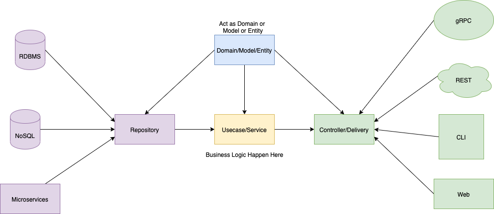
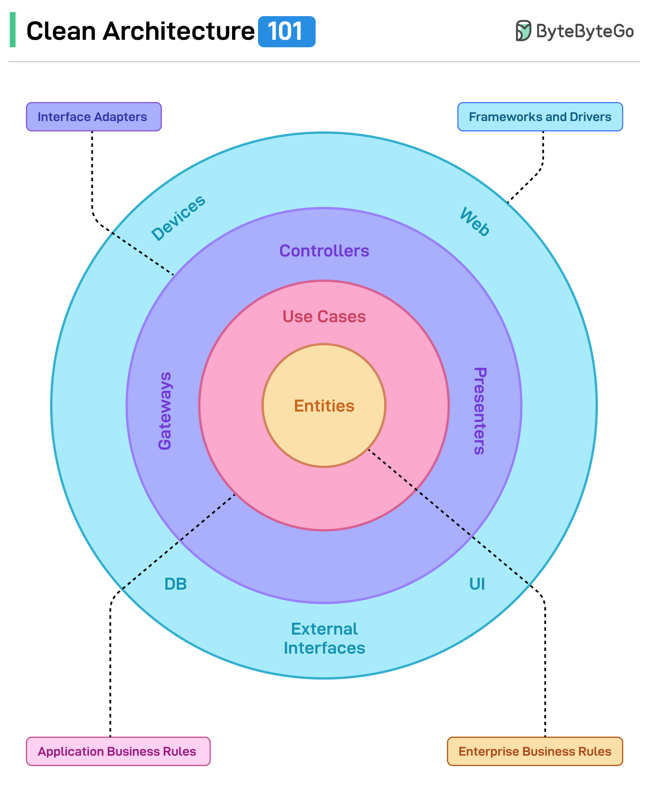

# Architecture

## app 项目结构
- controller: handler 层， 对应第一张图片中的绿色部分。目的是与 **use cases**隔离开来，比如后续 RPC 想要替换成 HTTP，只需要修改 handler 层的部分，use case 是不需要做任何修改的，也体现出use case 与**外部框架无关**的特点（本质就是解耦了）。
- usecases：只做**业务梳理**，调用domain/service。
- domain：
    - model：定义**业务实体**，外部调用（controllers）需要将对应的 req 转换成domain.model。
    - repository：use case 和 service 所需要的外部依赖(数据库，缓存，外部 rpc 调用）。
    - service：实现**核心业务**。
- infrastructure(目前没有想到好的名字)：对应外部依赖的具体实现，比如 mysql，redis，kafka，rpc 等。
