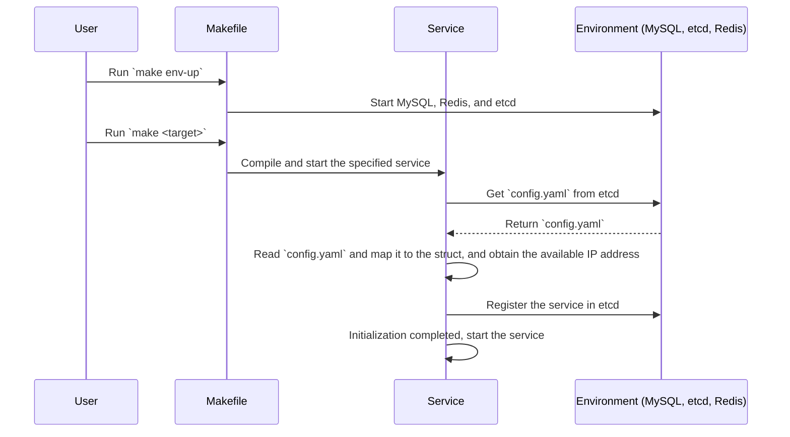
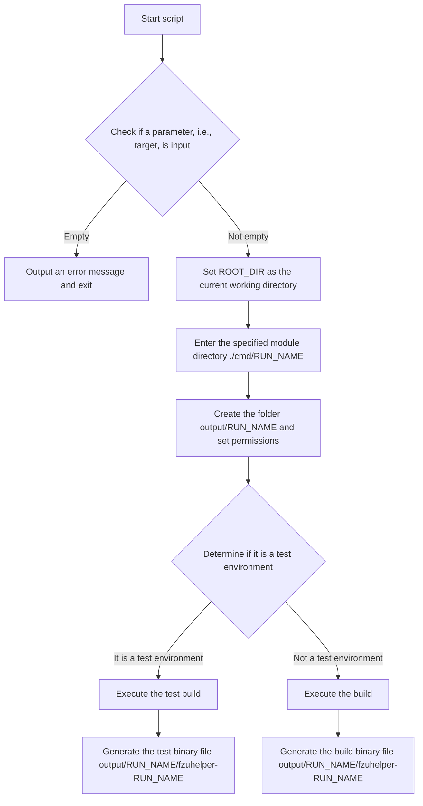
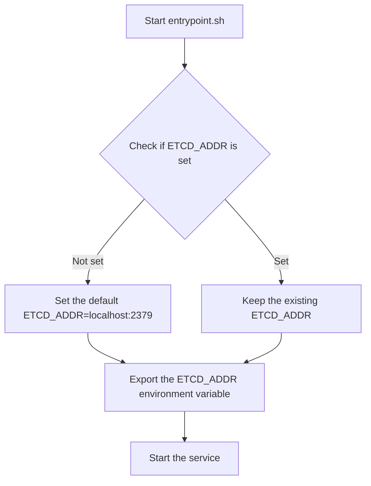
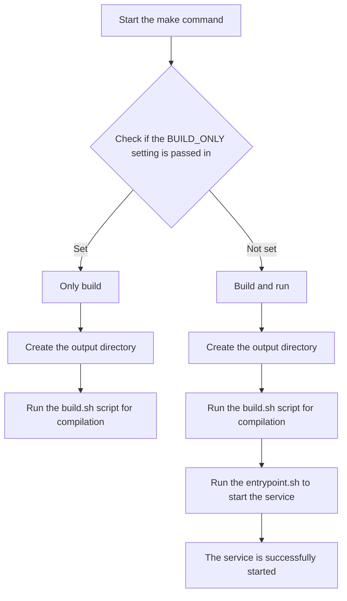

# Build

This guide will mainly introduce the project's building and startup processes, as well as related scripts.

Subsequent `<target>` refers to a certain service, such as `api`. You can specifically obtain the list of buildable services through `make help`.

## General Process

1. Use the command `make env-up` to start the environment (MySQL, etcd, Redis, etc.).
2. `make <target>` compiles and runs the specific service.
3. The service retrieves `config.yaml` from etcd.
4. Reads the configuration in `config.yaml` and maps the Env to the corresponding **struct**.
5. Obtains the available address from `config.yaml`.
6. Initializes the service and registers the service in `etcd`.
7. Starts the service.



## Building and Starting

### Directory Structure

The key directories of the project are as follows:

- `cmd/`: Contains the startup entry points of each service module.
- `output/`: The output directory for build products.

### Building Process

Here we explain the specific workflow when we type `make <target>`. We omit the content related to the tmux environment.

The building process is mainly completed through the [build.sh](../docker/script/build.sh) script, which is used to compile the binary files of the specified service module or conduct system tests:

1. Enter the corresponding service folder in `cmd`.
2. Execute `go build` to compile the binary file of this service and store it in the `output` folder.



### Output Directory Structure

```text
 output
 └── target
        └── binary
```

### Startup Process

When we type `make <target>` without setting the build-only flag (`BUILD_ONLY`), it will start automatically. Here we introduce the process of local debugging startup.

> The startup process of Docker containers is similar, except that it is moved into the container.

The startup process is mainly completed through the [entrypoint.sh](/docker/script/entrypoint.sh) script.

1. Use `export` to set the environment variable of the etcd address, so that the subsequent program can obtain the etcd address during **runtime** and get `config.yaml`.
2. `cd` to the `output` directory generated during the build stage and execute the binary file of the corresponding service.



## Usage

Both scripts are managed by the commands in `Makefile` and can be called through the following commands:

```shell
make <target> [option]   # option = BUILD_ONLY
```

The following is a rough flowchart of `make <target>`:


