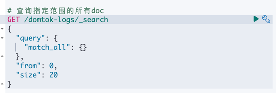

# efk 体系的必要性

当我们在本地部署的时候, 日志全部输出到 `output/log/svc` 下, 那我们想要查看日志显然是很方便的,
但如果数据量比较大, 或者我们的服务运行在云端, 这样的方法显然并不合适, 如果还按照这种原始的方法, 那就需要
ssh 到服务器进行查询, 如果是分布式部署, 那可能一次 debug 就需要连接多台服务器, 然后从这些文件中检索出自己想要的日志.
为了解决这个问题, 我们引入了 **"efk"(es-filebeat-kibana)** 体系, filebeat 部署于每一个服务器上, 收集服务器上的日志
并发送到 es 集群, 最终我们可以在 kibana 上进行统一的查询.

# 为什么不是 elk？

预算有限, 上不起 logStash, 再加上我们的需求本来就不复杂, 所以选择更轻量的 filebeat 作为替代品

# 如何查询？

这边以部署在本地的 efk 为例, 举一些简单但常用的 dev tools 的方法(画个饼, 后续我写好面板给大家可视化查询)

## 步骤: 
1. 打开你的 kibana 主页: 如果你没有更改 docker compose 的话, 那应该是 [kibana-home](http://localhost:5601/app/home#/)
2. 打开侧边栏, 找到最下方 Management 的开发工具, 点击然后进入到查询界面
3. 查询

可能你不太会相关的查询语句, 没关系, 下面是一些简单的使用, 你按照注释来就可以, size 和 from 你可以按需更改  
这里值得一提的是, 我们在 filebeat 中设置了日志的索引名字为为 domtok-logs

### 查看 logs index 的结构
```logstash
GET /domtok-logs
```

### 查询指定范围的所有doc
```logstash
GET /domtok-logs/_search
{
  "query": {
    "match_all": {}
  },
  "from": 0, 
  "size": 20
}

```

### 查询指定 service 的doc
```logstash
GET /domtok-logs/_search
{
  "query": {
    "match": {
      "service.keyword": "user"
    }
  },
  "from": 0, 
  "size": 20
}
```

### 查询指定 service 和 指定 source 的 doc, service 的默认 source 是 app-serviceName 比如 app-user
```logstash
GET /domtok-logs/_search
{
  "query": {
    "bool": {
      "must": [
        {"match": { "service.keyword": "user" }},
        {"match": { "source.keyword": "klog" }}
      ]
    }
  },
  "from": 0, 
  "size": 20
}
```

### 在上一个查询的基础上加上对 msg 内容的匹配
```logstash
GET /domtok-logs/_search
{
  "query": {
    "bool": {
      "must": [
        {"match": { "service.keyword": "user" }},
        {"match": { "source.keyword": "klog" }},
        {"match": { "msg": "etcd registry" }}
      ]
    }
  },
  "from": 0, 
  "size": 20
}
```

点击右边的箭头即可发送请求

