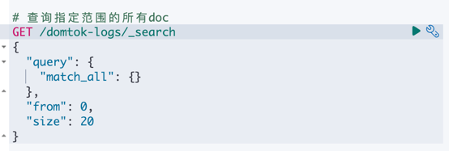

# EFK体系的必要性
在本地部署期间，日志会被方便地输出到 `output/log/svc` 目录下，这样就能轻松地检查日志。然而，当处理大量数据或基于云的服务时，这种方法就显得不够用了。如果依靠传统方法，就需要通过SSH访问服务器来查询日志。在分布式部署的场景中，一次调试会话可能需要连接多台服务器，然后再从众多文件中手动检索相关的日志。

为了解决这些难题，我们实施了 **“EFK”（Elasticsearch - Filebeat - Kibana）体系**。Filebeat部署在每台服务器上，收集本地的日志并将其转发到Elasticsearch集群。这种设置使得我们能够在Kibana上进行统一的日志查询。

# 为什么选择EFK而不是ELK？
由于预算有限，且我们的需求较为简单，我们选择了更轻量级的Filebeat来替代Logstash（Logstash是ELK堆栈中的一个核心组件）。

# 如何查询日志？
以本地部署的EFK为例，我们将介绍一些在Kibana的开发工具中基本且常用的查询方法。（注意：未来将开发一个更便于用户使用的可视化仪表板，以便更直观地查询日志。）

## 查询步骤：
1. 进入你的Kibana主页。如果你没有修改Docker Compose的配置，网址应该是 [kibana - home](http://localhost:5601/app/home#/)。
2. 打开侧边栏，找到底部“管理”（Management）选项下的“开发工具”（Dev Tools），点击进入查询界面。
3. 执行你的查询操作。

如果你不熟悉查询语句，不用担心。以下是一些简单的示例。只需按照给出的注释操作，并根据你的需求调整“size”和“from”参数即可。需要重点注意的是，在Filebeat中，我们已将日志索引名称设置为 `domtok-logs`。

### 查看日志索引的结构
```logstash
GET /domtok-logs
```

### 查询指定范围内的所有文档
```logstash
GET /domtok-logs/_search
{
  "query": {
    "match_all": {}
  },
  "from": 0, 
  "size": 20
}
```

### 查询指定服务的文档
```logstash
GET /domtok-logs/_search
{
  "query": {
    "match": {
      "service.keyword": "user"
    }
  },
  "from": 0, 
  "size": 20
}
```

### 查询指定服务和指定来源的文档。服务的默认来源格式为 `app - serviceName`，例如 `app - user`。
```logstash
GET /domtok-logs/_search
{
  "query": {
    "bool": {
      "must": [
        {"match": { "service.keyword": "user" }},
        {"match": { "source.keyword": "klog" }}
      ]
    }
  },
  "from": 0, 
  "size": 20
}
```

### 在之前查询的基础上，添加对 `msg` 内容的匹配
```logstash
GET /domtok-logs/_search
{
  "query": {
    "bool": {
      "must": [
        {"match": { "service.keyword": "user" }},
        {"match": { "source.keyword": "klog" }},
        {"match": { "msg": "etcd registry" }}
      ]
    }
  },
  "from": 0, 
  "size": 20
}
```

要发送查询请求，只需点击查询输入区域右侧的箭头即可。
 
